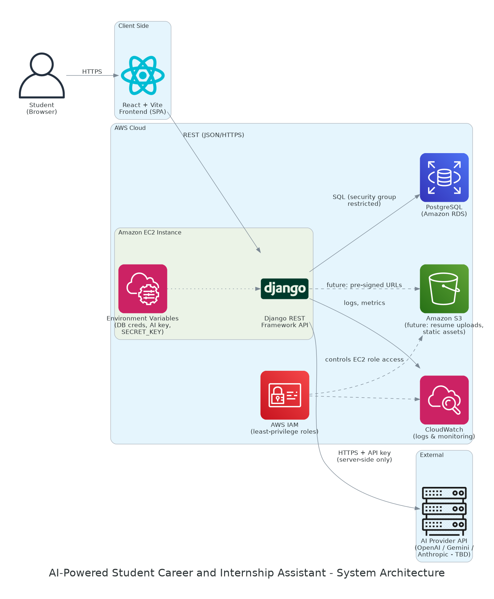

# AI-Powered Student Career and Internship Assistant

A web application that helps university students in IT-related fields prepare for internships and early-career opportunities. Students create a profile, list their technical skills, provide resume text or a career goal, and receive AI-assisted recommendations on career paths, missing skills, project ideas, learning plans, and internship readiness.

**Internship context:** Six-week software engineering internship project at Definite Creations, combining cloud engineering (AWS), AI integration, cybersecurity, and software engineering practice.

---

## Week 1 — Project Selection and Research Proposal

> If your repository already contains the original Week 1 section, keep that version and replace this summary — do not lose the sealed proposal wording.

### Problem Statement

Many undergraduate students in IT-related fields, particularly in Uganda, struggle to translate classroom learning into employable technical skills. They often do not know which career path fits their skills, which skills they are missing for their target roles, or what practical projects would strengthen their internship applications. Career guidance is limited and rarely personalized to a student's actual skill profile.

### Target Users

Undergraduate students in Software Engineering, Computer Science, Information Technology, Information Systems, Cybersecurity, Data Science, Computer Engineering, and related IT fields preparing for internships or early-career opportunities.

### Proposed Features

- Student profile creation (name, institution, program, year of study)
- Technical skills input with self-assessment
- Resume text or career-goal input
- AI-assisted recommendations: career paths, skill-gap analysis, project ideas, learning plans, internship readiness
- Recommendation history

### Initial Direction

AWS was selected as the cloud platform to align the project with cloud engineering learning goals. A GitHub repository was created with this README, and the one-page proposal, problem statement, and project timeline were completed and approved.

---

## Week 2 — System Design and Technical Research

Week 2 focused on answering how the system will be built: comparing technology options at every layer, locking in a final stack, and producing the design artifacts that guide the MVP build in Week 3. No application code was written in this phase, by design.

### Planned System Architecture



The system is a three-tier web application. A React (Vite) single-page frontend communicates with a Django REST Framework backend hosted on AWS EC2, which persists data to PostgreSQL on Amazon RDS. The backend is the single trusted component: it performs authoritative input validation, stores data, constructs AI prompts, and calls the external AI provider — the frontend never touches the AI API or its key. AWS IAM enforces least-privilege access for the EC2 instance, Amazon CloudWatch collects logs and monitoring events, and Amazon S3 is reserved for future resume uploads and static assets. Secrets (database credentials, AI API key, Django `SECRET_KEY`) are managed through environment variables and never committed to the repository.

Full diagram and component responsibilities: [`docs/ARCHITECTURE.md`](docs/ARCHITECTURE.md)

### Final Technology Stack

| Layer | Technology |
|---|---|
| Frontend | React + Vite |
| Backend | Django REST Framework |
| Database | PostgreSQL (Amazon RDS) |
| Cloud | AWS EC2 + Amazon RDS |
| Storage | Amazon S3 (future resume uploads / static assets) |
| Monitoring | Amazon CloudWatch |
| Security | AWS IAM, environment variables, server-side validation, authentication planning |
| AI Layer | API-based provider (OpenAI / Gemini / Anthropic — TBD, pending cost review and mentor approval) |

### Why Each Technology Was Selected

**React + Vite** — the application is form-heavy and stateful (profiles, skill lists, recommendation history), which suits component-based state management; Vite gives a fast development loop and a clean static build. **Django REST Framework** — provides the ORM, migrations, serializers, authentication, and security defaults this project needs out of the box, reducing integration risk within a six-week timeline. **PostgreSQL on RDS** — the data model is relational (users → profiles → skills → recommendations), and RDS adds managed-database cloud experience. **EC2 + RDS** — chosen over Elastic Beanstalk, App Runner, and Amplify because manual Linux provisioning, security groups, and environment configuration are exactly the cloud engineering skills this internship targets. **AI provider TBD** — the backend uses a provider-agnostic service layer so the final provider decision (based on cost and mentor approval) does not block MVP progress; a rule-based stub can serve for early testing.

Full comparison tables: [`docs/TECHNOLOGY_COMPARISON.md`](docs/TECHNOLOGY_COMPARISON.md)

### AWS Deployment Plan

1. Provision a free-tier-eligible EC2 instance (Ubuntu), hardened with security groups allowing only HTTPS/SSH.
2. Provision PostgreSQL on Amazon RDS, network-restricted so only the EC2 security group can connect.
3. Deploy the Django application behind Gunicorn and Nginx, with secrets injected via environment variables.
4. Serve the React production build (initially from the same instance; S3/CloudFront is a documented future option).
5. Attach an IAM role to the EC2 instance granting least-privilege access (CloudWatch; S3 later).
6. Ship application logs and error events to CloudWatch; enable billing alerts to stay within free-tier limits.

### Data Flow Summary


The student fills in profile, skills, and resume/career-goal text → the frontend performs basic validation and sends JSON to the backend → the backend re-validates and sanitizes all input, stores it in PostgreSQL, builds a structured prompt, and calls the external AI API → the AI response (career advice, skill-gap analysis, project ideas, or a learning plan) is stored as recommendation history and returned to the frontend for display → CloudWatch records logs and monitoring events throughout.

Full sequence diagram and step-by-step description: [`docs/DATA_FLOW.md`](docs/DATA_FLOW.md)

### Security Considerations (Design Phase)

- All input is re-validated server-side (DRF serializers); client-side validation is UX only.
- AI API key, database credentials, and `SECRET_KEY` exist only in server environment variables.
- Database access is restricted at the network level to the EC2 security group; all queries go through the ORM.
- The EC2 instance uses an IAM role — no long-lived access keys on the server.
- AI output is rendered as plain text to prevent injection through the recommendation channel.
- Resume text is treated as sensitive personal data; the amount forwarded to the AI provider is minimized and will be reviewed explicitly in Week 5.

### Week 2 Deliverables Completed

- [x] Architecture diagram (rendered PNG/SVG + Mermaid source) — `docs/ARCHITECTURE.md`, `docs/diagrams/`
- [x] Technology comparison table — `docs/TECHNOLOGY_COMPARISON.md`
- [x] Final technology stack decision — `docs/WEEK2_SYSTEM_DESIGN.md`
- [x] Data flow diagram (rendered PNG/SVG + Mermaid source) — `docs/DATA_FLOW.md`, `docs/diagrams/`
- [x] Updated README explaining the planned system design (this section)

### Repository Documentation

```
docs/
├── WEEK2_SYSTEM_DESIGN.md      Main design document, final stack decision, risks
├── ARCHITECTURE.md             Architecture diagram + component responsibilities
├── TECHNOLOGY_COMPARISON.md    Full option comparison tables
├── DATA_FLOW.md                Data flow sequence diagram + data sensitivity
└── diagrams/
    ├── architecture.png / .svg
    └── data_flow.png / .svg
```

### Next Step — Week 3: MVP Development

Build the first working version: profile form, skills input, resume/career-goal input, a working backend API endpoint with database persistence, and a basic frontend — committed incrementally to GitHub with a weekly report.

## Week 3 Status: Minimum Viable Product Build

Week 3 delivered a working local MVP: a Django REST API backend with real
data persistence, a React frontend with working forms, and a full
frontend-backend integration — all running locally against SQLite.

### Deliverables Completed

- [x] **Backend foundation** — Django + Django REST Framework project
  (`backend/`), configured with `django-cors-headers` and SQLite for local
  development
- [x] **Health-check API** — `GET /api/health/` confirms the backend is
  reachable
- [x] **Models and API endpoints** — `StudentProfile`, `Skill`,
  `CareerInput`, and `Recommendation` models, with serializers,
  `ModelViewSet`-based CRUD endpoints (`/api/profiles/`, `/api/skills/`,
  `/api/career-inputs/`, `/api/recommendations/`), and Django admin
  registration
- [x] **React frontend** — created with Vite (`frontend/`), homepage
  explaining the project, purpose, and user workflow
- [x] **Frontend forms** — `ProfileForm`, `SkillsForm`, `CareerInputForm`,
  and a live `SummaryPreview`, using the same field names and choice
  values as the backend models
- [x] **Frontend-backend integration** — forms submit directly to the
  Django API with loading, success, and error states; the app loads
  existing profiles from the backend on page load and tracks a simple MVP
  workflow status (profile created / skills added / career input
  submitted)
- [x] **Local MVP works end to end** — a student can create a profile, add
  skills, and submit resume/career-goal input, all persisted to the local
  database and verifiable via the Django REST API
- [x] **Testing, cleanup, and documentation** — manual end-to-end test
  pass, small code cleanup, and finalized documentation across the root,
  backend, and frontend READMEs plus `docs/WEEK3_MVP_BUILD.md`

### Repository Documentation

See `backend/README.md` and `frontend/README.md` for setup and run
instructions for each half of the app, and `docs/WEEK3_MVP_BUILD.md` for
the full Week 3 summary, testing checklist, and weekly report.

### Next Step — Week 4: AI Integration and AWS Deployment

Integrate an API-based AI provider to generate real recommendations
(skill gap analysis, career path suggestions, project ideas, learning
plans) from a student's profile, skills, and career inputs, and begin AWS
deployment — moving from SQLite to PostgreSQL/Amazon RDS and deploying the
backend and frontend per the plan in `docs/WEEK2_SYSTEM_DESIGN.md`.

## Week 4 Status: AI Integration and AWS Deployment — **Complete**

Week 4 moved the project from "a working local MVP" to "an application deployed
on AWS that produces AI-assisted recommendations."

| Deliverable | Status |
|---|---|
| AWS account safety — MFA, budget alert, credit check, CLI profile | ✅ Complete |
| Skill Gap Analysis feature implemented | ✅ Complete |
| Private Amazon RDS PostgreSQL deployed | ✅ Complete |
| Django backend deployed to EC2 | ✅ Complete and verified |
| Nginx and Gunicorn configured | ✅ Complete and verified |
| React frontend production build and deployment | ✅ Build and deployment files complete — not yet published on the instance |
| Amazon Bedrock integration added | ✅ Implemented and tested against a mocked client — **not yet enabled or called** |
| Live application link | 📍 `http://<ec2-public-address>/` — placeholder until an Elastic IP is allocated; the address changes on stop/start |
| Week 4 documentation and report | ✅ Complete |

**Two things are deliberately not claimed.** No Amazon Bedrock request has ever
been made from this project — model access is not enabled in the account and the
instance role has no `bedrock:InvokeModel` permission. And the frontend
deployment script has not yet been executed on the EC2 instance, though the
build it runs has been verified locally. Everything else in this section is
deployed and verified.

Week 4 documentation:
[`WEEK4_WEEKLY_REPORT.md`](docs/WEEK4_WEEKLY_REPORT.md) (supervisor report) ·
[`WEEK4_DEPLOYMENT_NOTES.md`](docs/WEEK4_DEPLOYMENT_NOTES.md) (architecture, deployment, checklists) ·
[`AI_PROMPT_DOCUMENTATION.md`](docs/AI_PROMPT_DOCUMENTATION.md) (prompt, safety, privacy) ·
[`WEEK4_AI_AND_DEPLOYMENT.md`](docs/WEEK4_AI_AND_DEPLOYMENT.md) (design write-up) ·
[`WEEK4_DAY4_DEPLOYMENT_REPORT.md`](docs/WEEK4_DAY4_DEPLOYMENT_REPORT.md) (AWS verification evidence)

### Day 1 — AWS account prepared safely

Before provisioning anything, the AWS account was secured: **MFA enabled** on
the root account, a **budget alert** created so spending cannot escalate
unnoticed, the available **AWS credit** checked, and a named **AWS CLI profile**
configured for local use. No billable resources were created.

### Day 2 — Environment variables and the first AI feature

- **Environment-driven configuration.** Added `python-decouple`, and moved
  `SECRET_KEY`, `DEBUG`, `ALLOWED_HOSTS`, `CORS_ALLOWED_ORIGINS`, and the AI
  provider settings into environment variables. `backend/.env.example`
  documents every variable with placeholders; the real `.env` is git-ignored and
  never committed. With `DEBUG=False` and no `SECRET_KEY`, Django now refuses to
  start rather than falling back to a public default.
- **Backend AI service layer.** `backend/career/services/ai_service.py` is the
  single place in the project allowed to talk to an AI provider. It is
  provider-agnostic, so swapping OpenAI / Gemini / Anthropic later touches one
  file.
- **Skill Gap Analysis added locally.** `POST /api/profiles/<id>/generate-skill-gap/`
  gathers a student's skills and career inputs, generates an analysis (career
  readiness summary, strengths, missing technical skills, missing professional
  skills, suggested projects, a 4-week learning plan, and limitations), saves it
  as a `Recommendation`, and returns it. Skill gap analysis was chosen first
  because it answers the exact question in the problem statement and needs no
  new data models.
- **Safe local fallback.** With `AI_PROVIDER=mock` the backend produces the
  analysis locally with no external call — the feature is fully demonstrable
  offline, at zero cost, with no student data leaving the machine. The API
  reports `used_fallback: true` so the mode is never ambiguous.
- **Frontend requests AI recommendations through the backend.** A new
  `AIRecommendationPanel.jsx` adds a "Generate Skill Gap Analysis" button with
  loading and error states. The frontend calls **only** the Django API — it holds
  no AI key and never contacts an AI provider, because anything in a React
  bundle is public the moment the page loads.
- **Tested.** 12 automated tests cover the health endpoint, the Week 3 CRUD
  endpoints, the new endpoint, the 404 case, the empty-profile case, and the AI
  service's fallback behaviour. All Week 3 features still work.

### Day 3 — Private Amazon RDS PostgreSQL prepared

- **A custom VPC with a public application tier and a private database tier.**
  The EC2 application subnets are public; the database subnets are private,
  spread across two Availability Zones (required for an RDS subnet group, and a
  prerequisite for Multi-AZ failover later).
- **The RDS PostgreSQL instance is private.** Public accessibility is disabled
  and it sits only in the private subnets, which have no route to the Internet
  Gateway — there is no path from the internet to the database, not merely a
  blocked one.
- **The RDS security group accepts PostgreSQL (TCP 5432) only from the EC2
  application security group.** Access is granted by security-group identity
  rather than by IP range, so only instances that join the application group can
  reach the database, whatever their address. A consequence worth stating plainly:
  the RDS endpoint **cannot** be reached from a local laptop, and that is the
  design working, not a fault to debug.
- **PostgreSQL environment-variable support added to Django.** `psycopg[binary]`
  was added, and `DB_HOST` now acts as a single switch: empty means the local
  SQLite file (unchanged local workflow), set means PostgreSQL on RDS using
  `DB_NAME`, `DB_USER`, `DB_PASSWORD`, `DB_PORT` (default `5432`), and
  `DB_SSLMODE` (default `require`). No endpoint, username, password, or database
  name is hard-coded anywhere. If `DB_HOST` is set but a credential is missing,
  Django refuses to start instead of silently falling back to SQLite.
- **A `python manage.py check_database` diagnostic command** reports the
  configured engine and runs `SELECT 1`. It never prints the database password,
  masks the host by default, and gives a readable failure message — it will be
  the first command run on EC2 to tell a configuration problem apart from a
  network one.
- **Tested without touching AWS.** 26 automated tests now cover the database
  selection rule and the diagnostic command alongside the existing AI feature —
  none of them require a database server, an RDS instance, or network access.
  Nothing was deployed and no connection to RDS was attempted.

### Day 4 — EC2 production configuration prepared

- **Gunicorn and Nginx deployment files added.** A new `deploy/` directory holds
  a systemd unit (`dc-intern-backend.service`), an Nginx site template, a
  deploy script, and a placeholder environment-file template. Nginx listens
  publicly on port 80 and serves collected static files; Gunicorn runs
  `config.wsgi:application` with two workers bound to **127.0.0.1:8000 only**,
  so the application cannot be reached from the internet except through the
  proxy. systemd restarts it on failure and starts it at boot.
- **Production Django settings completed.** `STATIC_ROOT` for `collectstatic`,
  `CSRF_TRUSTED_ORIGINS` from the environment, and `SECURE_PROXY_SSL_HEADER` so
  Django learns the original scheme from Nginx. All fifteen settings —
  `DEBUG`, `SECRET_KEY`, `ALLOWED_HOSTS`, `CORS_ALLOWED_ORIGINS`,
  `CSRF_TRUSTED_ORIGINS`, the six `DB_*` values and the three `AI_*` values,
  plus `USE_HTTPS` — come from the environment. Nothing is hard-coded.
- **HTTPS settings deliberately deferred, and the reason matters.** Secure
  cookies and `SECURE_SSL_REDIRECT` were previously tied to `DEBUG=False`. On a
  deployment serving plain HTTP that does not harden the site, it breaks it —
  browsers will not send a `Secure` cookie over HTTP, so logins fail. Those
  settings now sit behind a `USE_HTTPS` flag that stays `False` until TLS is
  terminated, at which point one environment variable turns them all on.
- **Private RDS connection ready.** The instance reaches the database purely by
  virtue of its security-group membership; `DB_SSLMODE=require` keeps the
  EC2 → RDS hop encrypted. Migrations run from the instance, never from a laptop.
- **Secrets stay off the instance's disk in the repository.** All configuration
  lives in `/etc/dc-intern/backend.env` (`root:ec2-user`, `0640`), sourced from
  AWS Systems Manager Parameter Store, outside `/opt/dc-intern` so `git` can
  never see it. The deploy script verifies the required keys exist without
  printing a single value, and never creates or fetches secrets itself.
- **Administration via AWS Systems Manager Session Manager**, so the instance
  needs no inbound SSH rule, no key pair, and no `.pem` file — access is
  IAM-controlled and logged.
- **The backend is deployed to EC2 and verified.** Amazon Linux 2023 in
  `eu-north-1`, Nginx serving publicly on port 80 and proxying to Gunicorn on
  `127.0.0.1:8000`, Django connected to the **private RDS PostgreSQL** instance
  with migrations applied, and the **public health endpoint returning `200`**.
  All four CRUD endpoints and the collected static files serve correctly.
- **Verified read-only against the live account:** the EC2 security group has
  exactly one inbound rule (TCP 80 — no SSH, no 8000, no 5432); RDS is
  `available`, not publicly accessible, encrypted at rest, and reachable only
  from the EC2 security group; the database password is a Parameter Store
  SecureString; and the instance's IAM policy is scoped to
  `/dc-intern/prod/*` read actions only.
- **Frontend cloud deployment remained for Day 5.** At the end of Day 4 the
  React app still pointed at `http://127.0.0.1:8000/api`, so the deployed
  backend had no deployed client.

Full closeout review — AWS verification evidence, a 22-point checklist, four
open items, and the evidence to capture for the internship report:
[`docs/WEEK4_DAY4_DEPLOYMENT_REPORT.md`](docs/WEEK4_DAY4_DEPLOYMENT_REPORT.md)

Design write-up, network diagram, request-flow diagram, and common failure
modes: [`docs/WEEK4_AI_AND_DEPLOYMENT.md`](docs/WEEK4_AI_AND_DEPLOYMENT.md)

### Day 5 — Frontend production deployment, Amazon Bedrock, Week 4 closeout

- **The frontend's API base URL is now a build-time variable.**
  `VITE_API_BASE_URL` gives `http://127.0.0.1:8000/api` locally and `/api` in
  production. **No IP address or hostname is compiled into the bundle** —
  verified by building both ways and grepping the output. This also dissolved a
  Day 4 blocker: the instance's public IP is ephemeral, so an absolute URL would
  have been wrong after the next stop/start; a relative one cannot go stale.
- **React and Django are served from one Nginx origin**, split by path: `/` and
  `/assets/` from `/var/www/dc-intern`, `/static/` from Django's collected
  files, and `/api/`, `/admin/`, `/api-auth/` proxied to Gunicorn on
  `127.0.0.1:8000`. SPA fallback via `try_files`, fingerprinted assets cached for
  a year, `index.html` served `no-cache`. One origin also means **no CORS in
  production at all**.
- **`deploy/scripts/deploy_frontend.sh`** installs with `npm ci`, builds, and
  publishes to `/var/www/dc-intern` as `root:root` (Nginx reads; it must not be
  able to rewrite the app's JavaScript), relabels for SELinux, validates and
  reloads Nginx, and smoke-tests `/`, a deep link, and `/api/health/`.
- **Amazon Bedrock added as the real AI provider**, through the Converse API and
  the EC2 instance's IAM role — **there is no AWS access key anywhere in this
  project**, and none should ever be added. `AI_PROVIDER`, `AI_MODEL`,
  `AWS_BEDROCK_REGION`, `AI_MAX_TOKENS`, `AI_TEMPERATURE`, and
  `AI_FALLBACK_TO_MOCK` control it; `mock` remains the default everywhere,
  including in every test.
- **The prompt lives in its own reviewable module** (`services/prompts.py`). It
  sends field of study, year, career interest, internship goal, skills with
  confidence levels, and the student's career text — **not the student's name**,
  which the analysis does not need — and instructs the model not to guarantee
  employment, invent qualifications, discriminate, or request extra personal
  data.
- **Failure handling is honest by construction.** AWS error detail never reaches
  the browser (codes map to written-for-users messages; only the code is
  logged). When Bedrock fails with `AI_FALLBACK_TO_MOCK=True`, four separate
  things say so: `provider: "mock"`, `fallback_used: true`, a `notes` entry, and
  a banner in the saved text. With `False`, a clean `503`.
- **Tested: 26 → 57 automated tests**, covering the prompt, the Bedrock request
  shape, response extraction, every error path, and both fallback modes — none
  of them touching AWS. One test fails deliberately if any boto3 client is
  constructed during the run.
- **Documented:** `AI_PROMPT_DOCUMENTATION.md`, `WEEK4_DEPLOYMENT_NOTES.md`, and
  `WEEK4_WEEKLY_REPORT.md`, plus updates to all three READMEs.

### Next Step — Week 5

1. Run the frontend deployment on the instance and capture the evidence.
2. Add authentication, then rate limiting on the AI endpoint — both are
   prerequisites for enabling a paid provider on a public endpoint.
3. Add TLS, then `USE_HTTPS=True`.
4. Enable Bedrock with a `bedrock:InvokeModel` permission scoped to the single
   model ARN, test with an invented profile, and record the first real response.
5. Allocate an Elastic IP for a stable demonstration link.
6. Ship application logs to CloudWatch.
