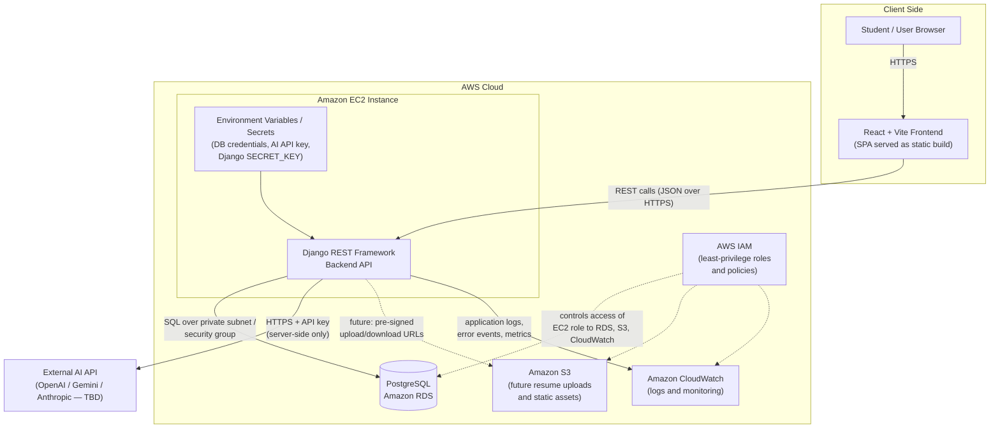

# System Architecture — AI-Powered Student Career and Internship Assistant

**Document status:** Week 2 deliverable — System Design and Technical Research
**Last updated:** July 2026

## 1. Overview

The system is a three-tier web application composed of a React (Vite) single-page frontend, a Django REST Framework backend API, and a PostgreSQL database hosted on Amazon RDS. An external AI provider is called from the backend only; the frontend never communicates with the AI API directly. All infrastructure runs on AWS, with IAM enforcing least-privilege access, CloudWatch handling logs and monitoring, and S3 reserved for future resume uploads and static assets.

This design was chosen to keep the architecture realistic for a six-week internship while still exercising genuine cloud engineering practices: managed database hosting, secrets management through environment variables, access control, and centralized monitoring.

## 2. Architecture Diagram

*Rendered diagram: `docs/diagrams/architecture.png` (PNG for reports/slides) and `docs/diagrams/architecture.svg` (scalable vector). The Mermaid source below renders natively on GitHub and can be edited as the design evolves.*

## 3. Component Responsibilities

**Student/User Browser.** Entry point. Loads the React SPA over HTTPS and interacts only with the frontend.

**React + Vite Frontend.** Renders the profile, skills, and resume/career-goal forms; performs basic client-side validation (required fields, length limits, format checks); calls the backend REST API; displays AI recommendations and recommendation history. It holds no secrets and no AI keys.

**Django REST Framework Backend.** The single trusted component. It authenticates requests, re-validates and sanitizes all input server-side, persists data to PostgreSQL through the Django ORM, constructs structured prompts, calls the external AI API, stores recommendation history, and returns JSON responses. Rate limiting and error handling live here.

**PostgreSQL on Amazon RDS.** Stores users, profiles, skills, resume/career-goal text, and AI recommendation history. RDS provides automated backups, patching, and restricted network access via security groups (only the EC2 instance may connect).

**External AI API.** Called exclusively from the backend. Provider is TBD (OpenAI, Google Gemini, or Anthropic) pending cost review and mentor approval. The abstraction lives in a single backend service module so the provider can be swapped without touching the rest of the codebase.

**Amazon S3.** Reserved for a later phase: resume file uploads (via backend-generated pre-signed URLs) and hosting of the frontend static build if the deployment evolves in that direction. Not required for the MVP.

**AWS IAM.** The EC2 instance runs under an IAM role granting only what it needs: CloudWatch log writes and (later) scoped S3 access. No long-lived access keys are stored on the server. Human/console access follows least privilege.

**Amazon CloudWatch.** Central destination for application logs, error events, and basic metrics (request counts, error rates). Supports the Week 5 security review by providing an audit trail.

**Environment Variables / Secrets.** Database credentials, the AI API key, and the Django `SECRET_KEY` are injected as environment variables on the EC2 instance and never committed to the repository. A `.env.example` file documents required variables without values.

## 4. Trust Boundaries

There are three trust boundaries in this design. First, between the browser and the backend: nothing from the client is trusted, so all validation is repeated server-side. Second, between the backend and the AI provider: outbound requests carry only the minimum necessary user data, and responses are treated as untrusted text (rendered safely, never executed or interpreted as instructions). Third, between the application and the database: access is restricted to the EC2 security group, and the ORM is used to prevent SQL injection.

## 5. Deliberate Simplifications

To keep scope realistic for a six-week internship, the design intentionally omits a load balancer, auto-scaling, container orchestration, a caching layer, and a message queue. A single EC2 instance with a managed RDS database is sufficient for the expected load and demonstrates the core cloud engineering skills without overengineering. These omissions are documented so they can be discussed honestly in the final report as known scalability limits.
