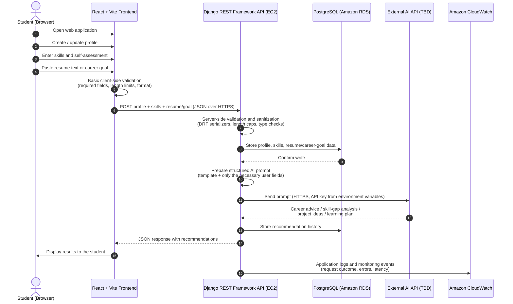

# Data Flow — AI-Powered Student Career and Internship Assistant

**Document status:** Week 2 deliverable — System Design and Technical Research

## 1. Purpose

This document describes how data moves through the system for the core user journey: a student creating a profile, submitting skills and a resume or career goal, and receiving AI-assisted recommendations. It also identifies where validation, storage, and monitoring occur, which feeds directly into the Week 5 security review.

## 2. Data Flow Diagram

*Rendered diagram: `docs/diagrams/data_flow.png` (PNG for reports/slides) and `docs/diagrams/data_flow.svg` (scalable vector). The Mermaid source below renders natively on GitHub and can be edited as the design evolves.*

## 3. Step-by-Step Description

1. **Student opens the web application.** The browser loads the React SPA over HTTPS.
2. **Profile creation/update.** The student fills in basic profile fields (name, institution, program, year of study).
3. **Skills and self-assessment.** The student lists technical skills and rates confidence levels.
4. **Resume or career goal input.** The student pastes resume text or a short career-goal statement into a bounded text field.
5. **Client-side validation.** The frontend checks required fields, enforces length limits, and blocks obviously malformed input. This improves user experience but is never trusted as a security control.
6. **Request to backend.** The frontend sends a JSON request to the DRF API over HTTPS.
7. **Server-side validation and sanitization.** DRF serializers re-validate every field: type checks, maximum lengths, and rejection of unexpected fields. This is the authoritative validation layer.
8. **Persistence.** The backend stores the profile, skills, and resume/career-goal text in PostgreSQL through the Django ORM (parameterized queries — no raw SQL).
9. **Prompt preparation.** The backend builds a structured prompt from a fixed template, inserting only the fields required for the recommendation. No credentials or internal identifiers are included.
10. **AI API call.** The backend calls the external AI provider over HTTPS using an API key loaded from environment variables. The key never reaches the frontend or the repository.
11. **AI response.** The provider returns career advice, skill-gap analysis, project recommendations, or a learning plan.
12. **History storage.** The backend stores the recommendation with a timestamp so students can review past results and the team can evaluate output quality.
13. **Display.** The frontend renders the recommendations as safe text (no HTML injection from AI output).
14. **Monitoring.** CloudWatch records request outcomes, errors, and latency, creating the audit trail used in the Week 5 security review.

## 4. Data Handled and Sensitivity

| Data | Source | Stored In | Sensitivity Notes |
|---|---|---|---|
| Profile (name, institution, program) | Student | PostgreSQL | Personal data — access restricted to the owning user |
| Skills and self-assessment | Student | PostgreSQL | Low sensitivity, still user-scoped |
| Resume text / career goal | Student | PostgreSQL | Potentially sensitive (contact details, history) — minimum necessary fields sent to the AI provider |
| AI recommendations | AI provider | PostgreSQL | Treated as untrusted text on render |
| Credentials, API keys | Operator | EC2 environment variables | Never in code, logs, or the database |

## 5. Security-Relevant Observations for Week 5

Validation happens twice by design (client and server), with the server as the authority. The AI API key exists only in server-side environment variables. Resume text is the most sensitive user input and will be covered explicitly in the Week 5 privacy review, including how much of it is forwarded to the external AI provider and whether the provider retains it.
