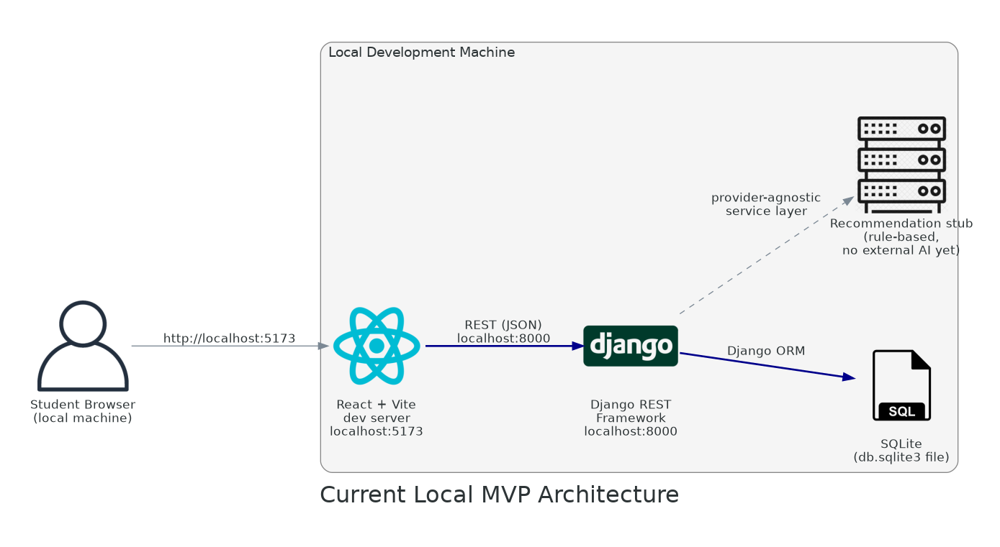
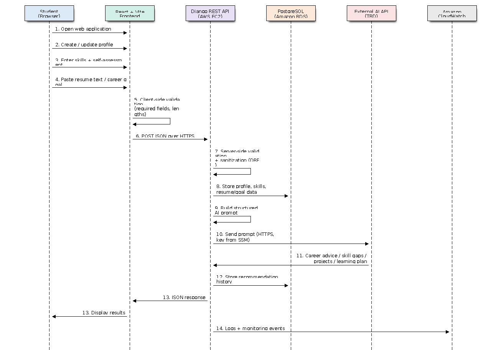

# AI-Powered Student Career and Internship Assistant

A web application that helps university students in IT-related fields prepare for internships and early-career opportunities. Students create a profile, list their technical skills, provide resume text or a career goal, and receive AI-assisted recommendations on career paths, missing skills, project ideas, learning plans, and internship readiness.

**Internship context:** Six-week software engineering internship project at Definite Creations, combining cloud engineering (AWS), AI integration, cybersecurity, and software engineering practice.

---

## Week 1 — Project Selection and Research Proposal

> If your repository already contains the original Week 1 section, keep that version and replace this summary — do not lose the sealed proposal wording.

### Problem Statement

Many undergraduate students in IT-related fields, particularly in Uganda, struggle to translate classroom learning into employable technical skills. They often do not know which career path fits their skills, which skills they are missing for their target roles, or what practical projects would strengthen their internship applications. Career guidance is limited and rarely personalized to a student's actual skill profile.

### Target Users

Undergraduate students in Software Engineering, Computer Science, Information Technology, Information Systems, Cybersecurity, Data Science, Computer Engineering, and related IT fields preparing for internships or early-career opportunities.

### Proposed Features

- Student profile creation (name, institution, program, year of study)
- Technical skills input with self-assessment
- Resume text or career-goal input
- AI-assisted recommendations: career paths, skill-gap analysis, project ideas, learning plans, internship readiness
- Recommendation history

### Initial Direction

AWS was selected as the cloud platform to align the project with cloud engineering learning goals. A GitHub repository was created with this README, and the one-page proposal, problem statement, and project timeline were completed and approved.

---

## Week 2 — System Design and Technical Research

Week 2 focused on answering how the system will be built: comparing technology options at every layer, locking in a final stack, producing the design artifacts that guide the MVP build, and subjecting the design to a structured architecture review before writing code.

### Current State and Target Architecture

Development follows a deliberate two-stage path:

**Current local MVP** — proves the application workflow first, at zero cloud cost:



React + Vite (localhost:5173) → Django REST Framework (localhost:8000) → SQLite, with a rule-based recommendation stub behind a provider-agnostic service layer standing in for the AI provider.

**Target AWS architecture** — the same application deployed securely and professionally:


The React frontend becomes a static build in S3 served through CloudFront, with Route 53 managing DNS. API requests enter through an Application Load Balancer in the public subnets and reach the Django backend on EC2 in **private application subnets** (no public IP). PostgreSQL on Amazon RDS sits in **private database subnets**, not publicly accessible. Outbound calls — including to the external AI provider — exit through a NAT Gateway, so AI API keys exist server-side only. All subnet tiers span two Availability Zones. Secrets live in SSM Parameter Store under an IAM instance role; CloudWatch collects logs, metrics, and billing alarms.

A simplified presentation version of the target diagram is at `docs/diagrams/architecture_simple.png`.

Full architecture, network zones, and security boundaries: [`docs/ARCHITECTURE.md`](docs/ARCHITECTURE.md)
Design review findings and corrections: [`docs/ARCHITECTURE_REVIEW.md`](docs/ARCHITECTURE_REVIEW.md)

### Final Technology Stack

| Layer | Technology |
|---|---|
| Frontend | React + Vite (static build on S3 + CloudFront in Phase 2) |
| Backend | Django REST Framework on EC2 |
| Database | PostgreSQL — Amazon RDS in deployment; SQLite in the local MVP only |
| Networking (target) | VPC with public / private app / private DB subnet tiers ×2 AZs, Route 53, CloudFront, ALB, NAT Gateway |
| Storage | Amazon S3 (frontend hosting in Phase 2; resume uploads later) |
| Monitoring | Amazon CloudWatch (logs, metrics, billing alarms) |
| Secrets | SSM Parameter Store (free tier); Secrets Manager as future upgrade for rotation |
| Security | IAM instance roles, layered security groups, server-side validation, authentication planning |
| AI Layer | API-based provider (OpenAI / Gemini / Anthropic — TBD); rule-based stub in the current MVP |

### Deployment Phasing

Following the architecture review (`docs/ARCHITECTURE_REVIEW.md`), deployment is phased for cost realism:

- **Phase 1 (Weeks 3–4, deployed):** single EC2 instance in a public subnet (SSH restricted, HTTPS via Nginx) + RDS in private subnets restricted to the instance's security group + SSM Parameter Store + CloudWatch. Same security principles, minimal cost.
- **Phase 2 (documented target):** ALB, private application subnets, NAT Gateway, CloudFront + S3 frontend. Deferred deliberately — the ALB (~$16–20/month) and NAT Gateway (~$32/month + data) are not free-tier, and Week 4's deliverable is the AI feature, not VPC routing.

### Data Flow Summary



The student fills in profile, skills, and resume/career-goal text → the frontend performs basic validation and sends JSON to the backend → the backend re-validates and sanitizes all input, stores it in PostgreSQL, builds a structured prompt, and calls the AI layer (currently the rule-based stub; the external provider in Week 4) → the response is stored as recommendation history and returned for display → CloudWatch records logs and monitoring events.

Full sequence diagram and step-by-step description: [`docs/DATA_FLOW.md`](docs/DATA_FLOW.md)

### Security Considerations (Design Phase)

- Layered isolation in the target design: internet → ALB → EC2 → RDS, each tier's security group accepting traffic only from the tier in front of it.
- The database has no internet route in either direction and is not publicly accessible — in both Phase 1 and Phase 2.
- AI API key, database credentials, and `SECRET_KEY` live in SSM Parameter Store (SecureString), fetched under an IAM instance role — never in the repository, AMI, or browser.
- No long-lived AWS access keys on the server.
- All input re-validated server-side (DRF serializers); AI output rendered as plain text to prevent injection.
- Resume text is treated as sensitive personal data; the amount forwarded to the AI provider is minimized and will be reviewed explicitly in Week 5.

### Week 2 Deliverables Completed

- [x] Architecture diagrams — local MVP, presentation version, detailed target (`docs/ARCHITECTURE.md`, `docs/diagrams/`)
- [x] Architecture design review with findings resolved — `docs/ARCHITECTURE_REVIEW.md`
- [x] Technology comparison table — `docs/TECHNOLOGY_COMPARISON.md`
- [x] Final technology stack decision — `docs/WEEK2_SYSTEM_DESIGN.md`
- [x] Data flow diagram — `docs/DATA_FLOW.md`
- [x] Updated README explaining the planned system design (this section)

### Repository Documentation

```
docs/
├── WEEK2_SYSTEM_DESIGN.md      Main design document, final stack decision, risks
├── ARCHITECTURE.md             Target architecture, network zones, security boundaries, phasing
├── ARCHITECTURE_REVIEW.md      Design review findings and corrections
├── TECHNOLOGY_COMPARISON.md    Full option comparison tables
├── DATA_FLOW.md                Data flow sequence diagram + data sensitivity
└── diagrams/
    ├── architecture_vpc.png / .svg          Detailed target architecture
    ├── architecture_simple.png / .svg       Presentation version
    ├── architecture_local_mvp.png / .svg    Current local MVP
    └── data_flow.png / .svg                 Request/data sequence
```

### Next Step — Week 3: MVP Development

Build the first working version: profile form, skills input, resume/career-goal input, a working backend API endpoint with database persistence, and a basic frontend — committed incrementally to GitHub with a weekly report.
