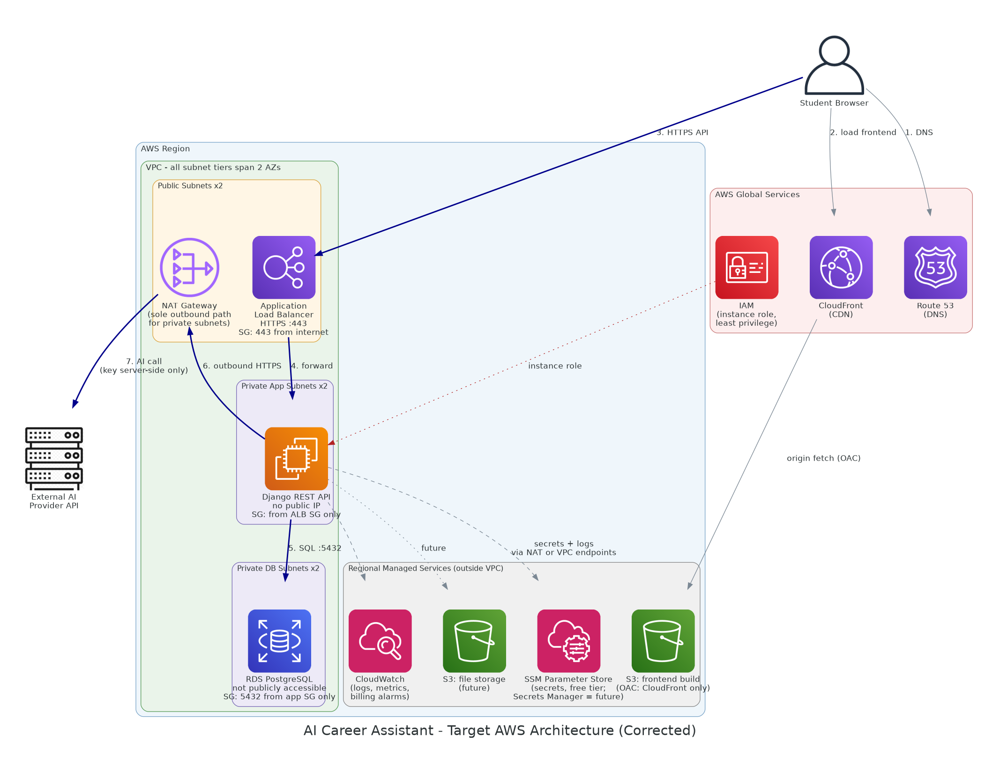
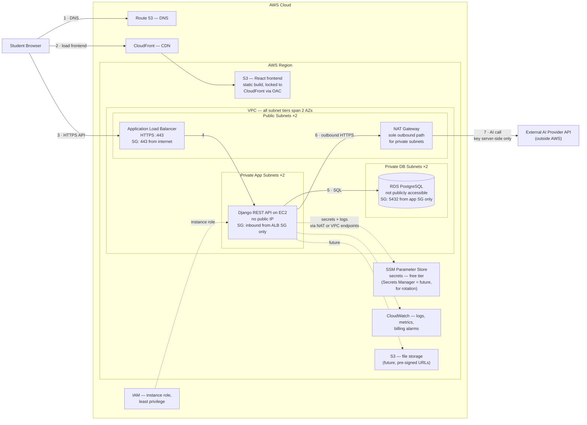

# System Architecture — AI-Powered Student Career and Internship Assistant

**Document status:** Week 2 deliverable — v3 (post design review)
**Last updated:** July 2026

## 1. Overview

The system is a three-tier web application deployed on AWS with explicit network isolation. The React (Vite) frontend is built to static files, hosted in Amazon S3, and served through CloudFront. API traffic enters through an Application Load Balancer in the public subnets and is forwarded to a Django REST Framework backend on EC2 in **private application subnets** — the instance has no public IP. PostgreSQL on Amazon RDS lives in **private database subnets** and is not publicly accessible. All outbound traffic from the private subnets (AI provider calls, secrets, package updates) exits through a NAT Gateway. Secrets are held in **SSM Parameter Store** (free tier; Secrets Manager is a future upgrade for automatic rotation), IAM instance roles scope all service access, and CloudWatch collects logs, metrics, and billing alarms. All subnet tiers span two Availability Zones, as required by the ALB and the RDS subnet group.

This document describes the **target architecture**. The deployment is phased (Section 6): Phase 1 deploys the same application on a cost-controlled layout during the internship; this diagram is the documented production target.

## 2. Architecture Diagram

*Rendered files: `docs/diagrams/architecture_vpc.png/.svg` (detailed target), `docs/diagrams/architecture_simple.png/.svg` (presentation version), `docs/diagrams/architecture_local_mvp.png/.svg` (current local MVP). The Mermaid source below renders natively on GitHub.*

## 3. Network Zones and What Lives Where

**External.** The student's browser touches exactly three public entry points: Route 53 (DNS), CloudFront (frontend), and the ALB (API). The AI provider is external in the other direction — reachable only outbound, only from the backend.

**AWS Global Services.** Route 53, CloudFront, and IAM are global — not tied to any region.

**AWS Region.** The VPC, RDS, S3 buckets, SSM Parameter Store, and CloudWatch are regional. S3, SSM, and CloudWatch sit outside the VPC; the backend reaches them through the NAT Gateway or, as an optimization, through VPC endpoints (Gateway endpoint for S3, Interface endpoints for SSM/CloudWatch), which keep that traffic off the public internet entirely. RDS is managed regionally but its network interfaces live inside the VPC's DB subnets — which is why it is drawn inside.

**VPC.** Three subnet tiers, each spanning two Availability Zones (an ALB requires two AZs, and an RDS subnet group requires two AZs even for a single-AZ instance):

- **Public subnets.** Route to the Internet Gateway. Contain the ALB (sole public API entry, TLS on :443) and the NAT Gateway (sole outbound path for private subnets).
- **Private application subnets.** The Django EC2 instance: no public IP; internet-bound traffic routes to the NAT Gateway; inbound permitted only from the ALB's security group.
- **Private database subnets.** RDS PostgreSQL via a DB subnet group: "publicly accessible" disabled; inbound :5432 only from the EC2 security group; no internet route in either direction.

## 4. Security Boundaries

1. **Edge:** all public traffic is HTTPS; the S3 frontend bucket is locked to CloudFront via Origin Access Control; the ALB is the only public API surface.
2. **Network:** backend and database have no public IPs; the DB subnets have no internet route.
3. **Security groups:** `alb-sg` allows :443 from the internet; `app-sg` allows the application port only from `alb-sg`; `db-sg` allows :5432 only from `app-sg`. Each tier is reachable only from the tier directly in front of it.
4. **Identity:** the EC2 instance runs under an IAM role granting least-privilege access to its SSM parameters, CloudWatch, and (later) scoped S3. No long-lived access keys on the instance.
5. **Secrets:** database credentials, AI API key, and Django `SECRET_KEY` live in SSM Parameter Store (SecureString), fetched at startup under the instance role — never in the repository, AMI, or user data.
6. **Application:** all input re-validated server-side (DRF serializers); AI output rendered as plain text; the AI key never exists client-side.

## 5. Request Flow (Numbered on the Diagram)

1. Browser resolves the domain via Route 53.
2. Browser loads the frontend from CloudFront (S3 origin on cache miss).
3. The React app calls the API subdomain over HTTPS, which resolves to the ALB.
4. The ALB forwards to the Django target in the private app subnets.
5. The backend reads/writes RDS PostgreSQL in the private DB subnets.
6. For AI recommendations, the backend sends outbound HTTPS to the NAT Gateway.
7. The NAT Gateway forwards to the external AI provider; the response returns along the same path, is stored as recommendation history, and returns to the browser via the ALB.

Throughout, the backend fetches secrets from SSM and ships logs/metrics to CloudWatch, both via the NAT path or VPC endpoints.

## 6. Deployment Phasing and Cost Note

Two components in the target design are the main cost drivers and are not free-tier: the ALB (~$16–20/month) and the NAT Gateway (~$32/month plus per-GB processing). Secrets Manager would add $0.40/secret/month, which is why SSM Parameter Store (free standard tier) is the selected secrets store for this project.

- **Phase 1 (deployed during the internship, Weeks 3–4):** single EC2 instance in a public subnet (SSH restricted to a known IP, HTTPS via Nginx), RDS in private subnets with `db-sg` accepting :5432 only from the EC2 SG, secrets in SSM Parameter Store, logs to CloudWatch. Identical security principles, minimal cost.
- **Phase 2 (documented target, this diagram):** ALB + private app subnets + NAT Gateway + CloudFront/S3 frontend.

**Future improvements (documented, not deployed):** VPC endpoints replacing NAT dependency for AWS-service traffic; Secrets Manager with automatic rotation; Multi-AZ RDS; AWS WAF on the ALB; CloudFront in front of the API.

The phasing was reviewed and endorsed in the design review — see `docs/ARCHITECTURE_REVIEW.md`.
